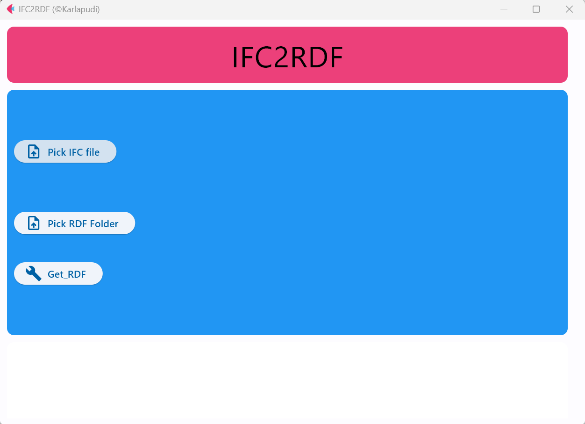
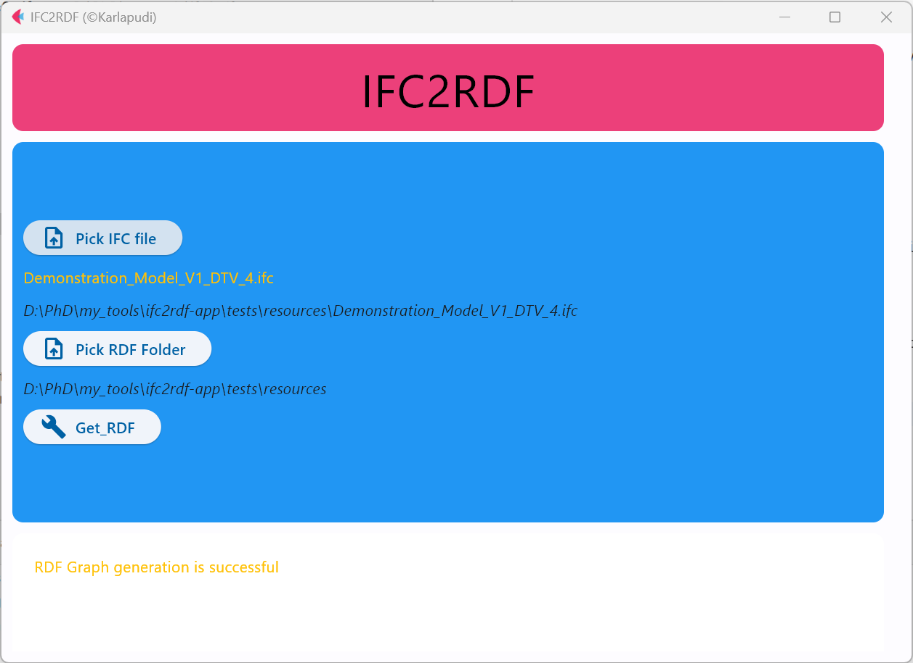

# IFC2RDF APP

An application developed based on flet to convert BIM data from IFC to RDF.

To run the app:

```
flet run .\ifc2rdf_app\ifc2rdfApp.py
```

The following screenshot illustrates apps basic features.



Upon the assignment of input data, the generation process 
is initiated by pressing `Get_RDF` button.

After the completion of generation process
the app outputs the status message indicating whether 
the process is successful or not. 

Bellow image illustrates an example of successful
RDF graph generation process.

